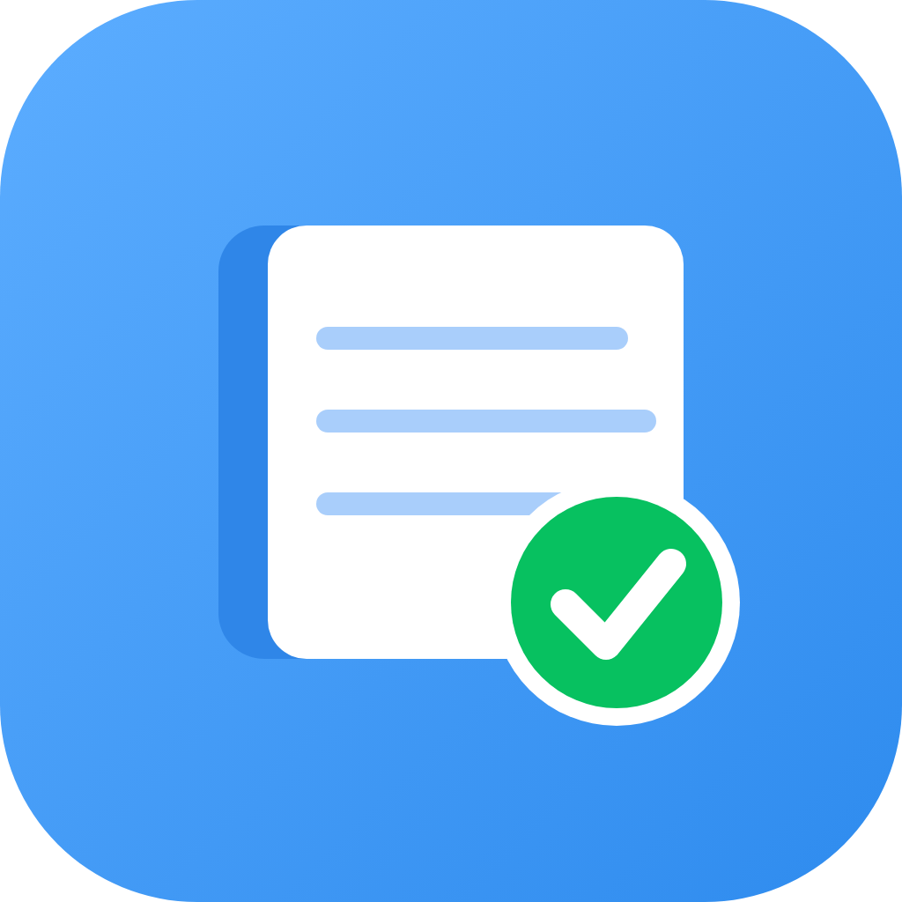

<div align="center">



# 随手记账 snap-ledger

**一款完全本地化的个人记账应用 · 数据不出设备**

无账户体系 · 无联网上传 · 无广告

[](#平台)
[](LICENSE)

</div>

## 这是什么

一本装在口袋里的账本：支出记一笔，收入记一笔，随手就完事。
所有账目只存在你自己的设备里——不需要注册，不需要联网，卸载应用数据也只随你自己处置。

## 功能

**记账**
- 三步记一笔：选分类 → 输金额 → 保存，内置专用数字键盘
- 支出 / 收入一键切换，日期与具体时刻可分别调整
- 备注自由填写，还可**附加图片**（原图保存、不限张数、文件自动改名）

**账本**
- 多账本分组：日常、旅行、装修……各记各的互不混淆
- 默认显示全部账本汇总，一键切换到单个账本

**看账**
- 明细页按天分组，当日 / 当月收支一目了然，支持月预算
- **日历视图**：整月每天收了多少钱、花了多少钱，一眼扫过；点某天直接看当日明细
- 统计：周报 / 月报 / 年报，折线趋势、分类占比、支出排行，
  「对比上月 / 去年」直接给出上一周期的具体金额

**数据安全**
- 一键导出备份（zip 包，含全部图片），**可设置密码**（AES-256-GCM 加密）
- 导出 CSV 明细表，Excel 直接打开
- 换机迁移：新设备选择备份文件即可完整还原
- 账单删除可撤销，误删不慌

**界面**
- 深色 / 浅色 / 跟随系统，六种主题色
- 内置图文使用指南，上手零门槛

## 隐私承诺

- 账目、图片、备份**全部保存在本机**，应用没有任何联网上传能力
- 备份密码不存储在任何地方——忘了就真的解不开，这也意味着没有后门

## 平台

| 平台 | 状态 |
| --- | --- |
| Windows | ✅ 可构建运行 |
| Android | ✅ 可构建安装 |
| iOS | 代码兼容，未验证 |

## 从源码构建

```bash
git clone https://github.com/dingtongbin/snap-ledger.git
cd snap-ledger
flutter pub get
flutter run -d windows    # 或 flutter build apk
```

需要 Flutter 3.35+。国内网络建议将 `PUB_HOSTED_URL` 与
`FLUTTER_STORAGE_BASE_URL` 指向 flutter-io.cn 镜像。

## 作者与版权

- 作者：**dingtongbin**（[github.com/dingtongbin](https://github.com/dingtongbin)）
- 软件名称：随手记账（snap-ledger），当前版本 v0.1.0
- Copyright © 2026 dingtongbin

## 许可证

[GPL-3.0](LICENSE)。自由使用、自由修改、自由分发；基于本程序的作品同样必须以 GPL-3.0 开源。
